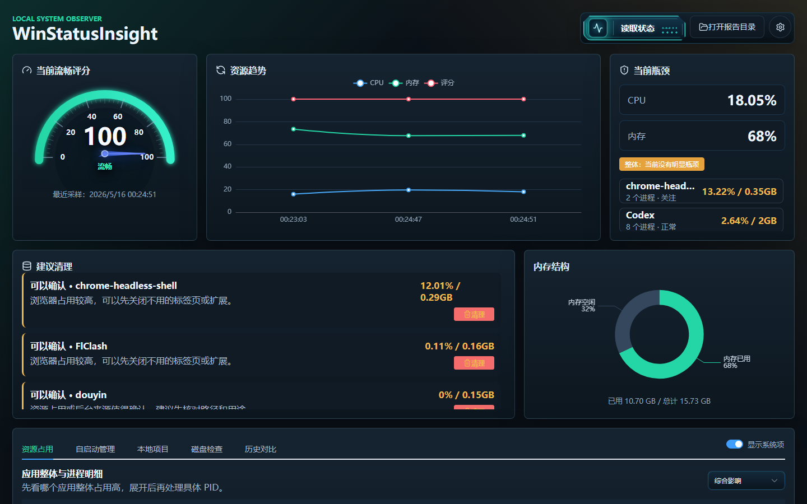
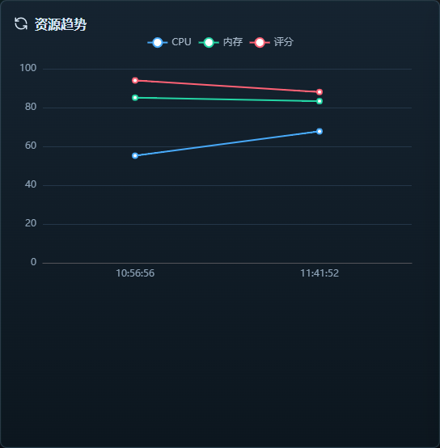
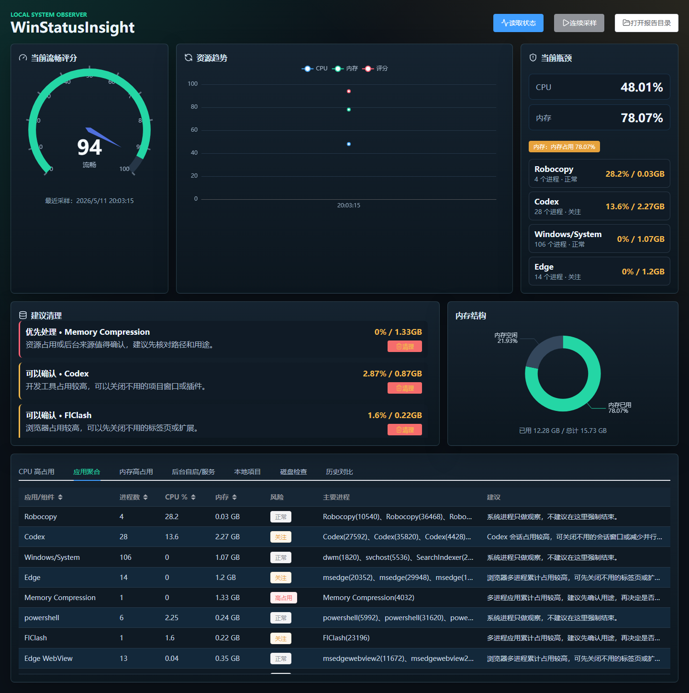
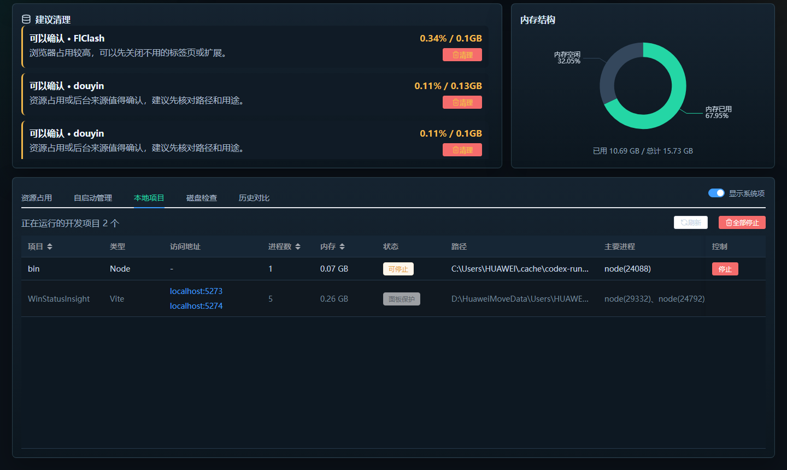
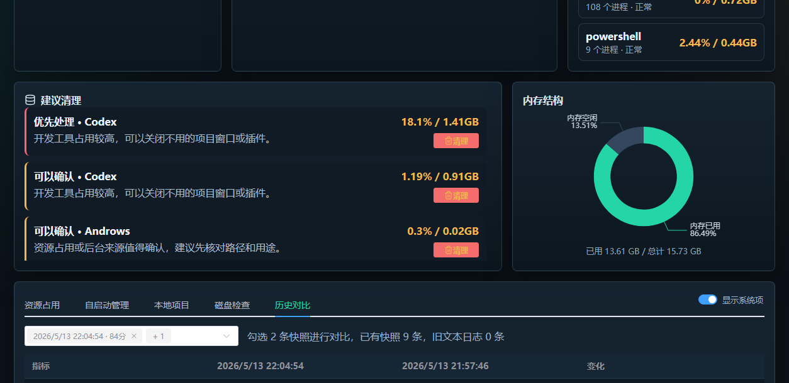
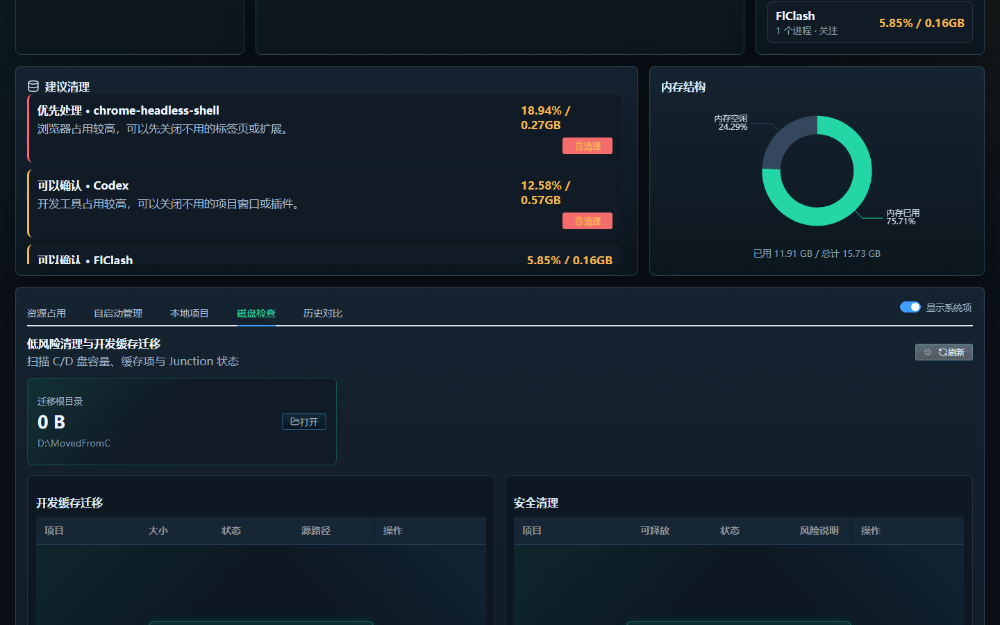

# WinStatusInsight 2.0

WinStatusInsight 是一款面向 Windows 桌面环境的本地状态洞察工具。它把系统资源采样、进程归因、本地开发服务识别、历史对比、磁盘空间治理和开机自启动管理整合到一个桌面应用中，帮助用户快速判断“电脑为什么卡”、哪些进程值得关注、哪些缓存可以安全处理。

它不是远程监控工具，也不上传数据。所有采集、分析、快照和清理迁移动作都在本机完成。

## 产品定位

WinStatusInsight 面向个人开发者、Windows 重度办公用户和本地调试环境，重点解决三类问题：

- **卡顿归因**：把 CPU、内存、进程、应用聚合和历史趋势放在同一个视图里，帮助判断卡顿来自浏览器、资源管理器、本地开发服务还是后台进程。
- **本地开发环境治理**：识别正在运行的 Vite、Next、Node、.NET Web API、`.NET watch`、pnpm、bun 等开发服务，并支持对非面板项目执行确认式停止。
- **低风险系统维护**：只对临时文件、可重建开发缓存和明确可恢复的自启动项提供操作入口；高风险应用数据只做分析提示，不直接删除或迁移。

## 下载

- [便携版 WinStatusInsight.exe](https://github.com/zgxhh/WinStatusInsight/releases/latest/download/WinStatusInsight.exe)
- [安装版 WinStatusInsight-Setup-2.0.0.exe](https://github.com/zgxhh/WinStatusInsight/releases/latest/download/WinStatusInsight-Setup-2.0.0.exe)

便携版适合免安装运行、临时诊断、放在桌面或 U 盘中直接打开。首次启动会有解压和服务初始化过程，应用内带启动等待页，避免用户误以为无响应。

安装版适合长期使用，会写入固定安装目录，并创建开始菜单、桌面快捷方式和卸载入口。若安装在 `D:\Download` 等特殊权限目录后出现瞬退，建议改装到 `D:\Apps\WinStatusInsight` 这类普通目录，或为安装目录授予当前用户完整权限。

## 产品截图

### 总览



### 资源趋势



### 应用聚合



### 本地项目



### 历史对比



### 磁盘检查



## 核心能力

### 状态读取与瓶颈归因

- 读取 Windows 当前 CPU、内存、磁盘和进程状态。
- 生成流畅度评分，并给出 CPU、内存、磁盘和高占用应用的瓶颈摘要。
- 启动时自动恢复最近一次读取结果，不再以空白页进入应用。
- 读取状态时仪表盘以快速转动方式展示采样过程，完成后平滑落到最终评分。

### 应用聚合分析

- 将多进程应用聚合为一个可读对象，例如 Chrome、Edge、Node/Vite、Codex、Windows 资源管理器、Huawei services。
- 汇总进程数、CPU、内存、风险等级、主要进程和处理建议。
- 支持隐藏或显示系统项，系统项默认受保护并排在普通用户项之后。

### 本地开发项目管理

- 自动识别正在运行的本地开发服务，支持 Vite、Next、Node、.NET Web API、`.NET watch`、pnpm、bun 等常见开发方式。
- 展示项目名称、类型、`localhost:端口` 访问地址、进程数、内存、路径和主要进程。
- 当前 WinStatusInsight 面板自动进入保护状态，不会被“全部停止”误关。
- 可停止项目支持单独停止或全部停止，执行前会二次确认。

### 自启动管理

- 读取 Windows 开机自启动项，包括当前用户 `Run` 注册表和 Startup 启动文件夹。
- 当前用户自启动项可在工具内开关，关闭时会保留备份，后续可以恢复。
- 系统级自启动项只读置灰，避免误改所有用户或系统安全相关配置。

### 磁盘检查与安全治理

- 展示 C/D 盘容量、迁移根目录、C 盘大项、开发缓存、应用缓存和执行日志。
- 支持低风险清理：24 小时前 Temp 临时文件、旧 Electron 便携版解压残留、回收站单独确认清空。
- 支持将开发缓存迁移到 `D:\MovedFromC` 并创建 Junction，例如 Yarn、npm-cache、NuGet、pnpm、ms-playwright、AzureFunctionsTools。
- Chrome 本地模型、Codex、微信、剪映、抖音、微信开发者工具等高风险应用数据只分析和提示，不提供直接删除或硬迁移按钮。

### 历史快照与对比

- 每次读取状态都会保存快照。
- 支持选择两次读取结果进行对比，展示评分、CPU、内存变化。
- 自动分析“变重应用”和“变轻应用”，用于判断卡顿是否来自浏览器、资源管理器、本地开发服务或后台进程变化。

### 桌面体验

- Electron 桌面应用，内置 Express 本地服务和 PowerShell 采集脚本。
- 打包版使用随机本地端口，避免和开发服务端口冲突。
- 支持应用图标、启动等待窗口和关闭时最小化到系统托盘。
- 快照数据写入 Electron 用户数据目录，不写入 exe 内部。

## 技术架构

```text
Vue 3 + Vite + Element Plus + ECharts + lucide-vue-next
Node.js + Express
PowerShell Windows 状态采集
Electron + electron-builder
```

前端负责仪表盘、表格、对比分析和操作确认；后端负责本地接口、PowerShell 采集、快照保存、项目识别、磁盘扫描和安全操作；Electron 负责桌面窗口、托盘、启动等待页和打包运行时。

## 本地开发

```powershell
npm install
npm run dev
```

默认地址：

```text
前端：http://127.0.0.1:5273
后端：http://127.0.0.1:5274
```

桌面调试：

```powershell
npm run electron:dev
```

## 打包

生成便携版：

```powershell
npm run package:win
```

生成安装版：

```powershell
npm run package:win:installer
```

产物默认位于：

```text
release/WinStatusInsight.exe
release/WinStatusInsight-Setup-2.0.0.exe
```

## 数据与权限

- 开发环境快照：`data/snapshots`
- 打包版快照：Electron 用户数据目录下的 `data/snapshots`
- PowerShell 采集脚本：`scripts/collect-status.ps1`
- 开发缓存迁移目标：`D:\MovedFromC\Users\HUAWEI\...`
- 开机自启动关闭备份：当前用户注册表或 `%APPDATA%\WinStatusInsight\DisabledStartup`

## 安全边界

WinStatusInsight 默认偏保守：系统进程、系统级自启动项、安全软件、更新服务和高风险应用数据不会被静默处理。所有清理、停止、迁移和自启动开关操作都会通过前端确认，避免误删、误停或破坏系统配置。

Windows 首次运行未签名的本地打包程序时，可能会触发 SmartScreen 或安全软件提示。
