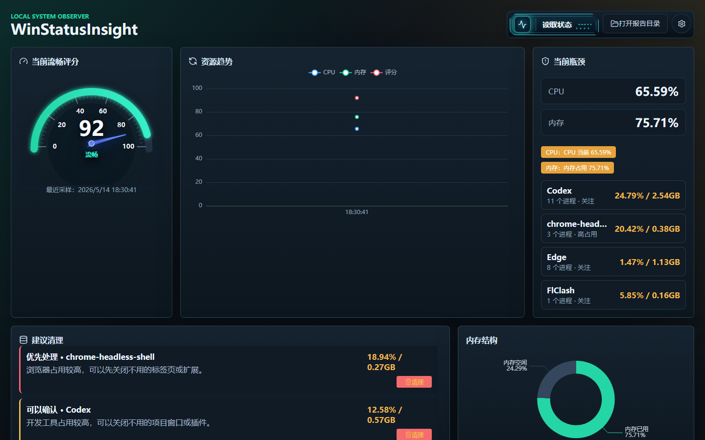
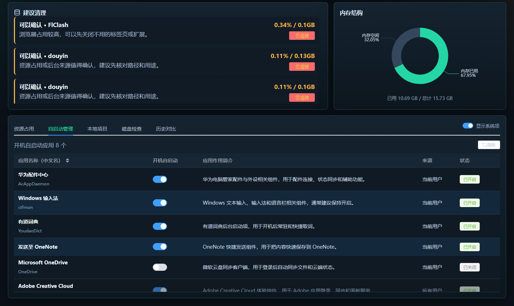

# WinStatusInsight 2.1.3

WinStatusInsight 是一款面向 Windows 桌面环境的本地状态分析工具。它把系统资源采样、进程归因、本地开发服务识别、历史对比、磁盘空间治理和开机自启动管理整合到一个桌面应用中，用来快速判断“电脑为什么卡”“哪些应用正在拖慢系统”“哪些开发缓存可以安全处理”。

它不是远程监控工具，也不会上传采样数据。系统读取、分析、快照、清理和迁移动作都在本机完成；只有用户手动点击“检查版本更新”时才会访问 GitHub Release。

## 下载

[下载 WinStatusInsight-Setup-2.1.3.exe](https://github.com/zgxhh/WinStatusInsight/releases/latest/download/WinStatusInsight-Setup-2.1.3.exe)

## 产品截图

### 总览


### 资源占用



### 自启动管理



### 本地项目


### 磁盘检查


### 历史对比


## 核心能力

### 状态读取与瓶颈归因

- 读取 Windows 当前 CPU、内存、磁盘和进程状态。
- 生成流畅评分，并给出 CPU、内存、磁盘和高占用应用的瓶颈摘要。
- 启动时自动恢复最近一次读取结果，避免每次进入应用都是空白状态。
- `/api/status` 采用快速核心采集，核心结果优先返回；自启动、服务等慢元数据后台缓存补齐。
- 返回采集耗时字段，方便定位读取状态到底耗在哪个阶段。

### 资源占用分析

- 将多进程应用聚合到一个资源占用视图中，例如 Chrome、Edge、Node/Vite、Codex、Windows 资源管理器、Huawei services。
- 主表展示应用整体影响：进程数、CPU、内存、风险、主要进程和建议。
- 支持展开查看具体 PID、进程名、路径、标签和清理控制。
- 支持按综合影响、CPU 优先、内存优先排序。
- 系统项可显示或隐藏；系统、面板和受保护进程会置灰且不可清理。

### 本地项目管理

- 自动识别正在运行的本地开发服务，支持 Vite、Next、Node、.NET Web API、`.NET watch`、npm、pnpm、bun 等常见方式。
- 展示项目名称、类型、`localhost:端口` 访问地址、进程数、内存、路径和主要进程。
- 当前 WinStatusInsight 面板自动进入保护状态，不会被“全部停止”误关。
- 可停止项目支持单独停止或全部停止；系统进程、面板进程和受保护进程会自动跳过，并显示执行结果摘要。
- 支持托盘本地项目占用提醒，帮助发现长时间运行且占用偏高的开发服务。

### 自启动管理

- 读取 Windows 开机自启动项，包括当前用户 `Run` 注册表和 Startup 启动文件夹。
- 当前用户自启动项可在工具内开关。
- 关闭自启动时保留备份，后续可恢复。
- 系统级自启动项只读展示，避免误改所有用户或系统安全相关配置。

### 磁盘检查与安全治理

- 展示 C/D 盘容量、迁移根目录、C 盘大项、开发缓存、应用缓存和执行日志。
- 支持低风险清理：超过 24 小时的 Temp 临时文件、旧 Electron 解压残留、回收站清空。
- 支持将开发缓存迁移到 `D:\MovedFromC` 并创建 Junction，例如 Yarn、npm-cache、NuGet、pnpm、ms-playwright、AzureFunctionsTools。
- Chrome 本地模型、Codex、微信、剪映、抖音、微信开发者工具等高风险应用数据只分析和提示，不提供直接删除或硬迁移按钮。
- 打开目录按钮带防连点状态，避免卡顿时重复触发资源管理器。

### 历史快照与对比

- 每次读取状态都会保存快照。
- 支持选择两次读取结果进行对比，展示评分、CPU、内存变化。
- 自动分析“变重应用”和“变轻应用”，帮助判断卡顿是否来自浏览器、本地开发服务、资源管理器或后台进程变化。

### 桌面体验

- Electron 桌面应用，内置 Express 本地服务和 PowerShell 采集脚本。
- 打包版使用随机本地端口，避免和开发服务端口冲突。
- 支持应用图标、关闭时最小化到系统托盘、手动检查版本更新。
- 版本更新使用 `electron-updater`：用户手动检查更新，点击“下载并自动安装”后优先差量下载，下载完成自动重启并安装新版。
- 快照数据写入 Electron 用户数据目录，不写入安装目录或 exe 内部。
- 主界面采用深色科技风格，读取状态按钮和流畅评分表盘针对桌面观感做了强化。

## 技术栈

```text
Vue 3 + Vite + Element Plus + ECharts + lucide-vue-next
Node.js + Express
PowerShell Windows 状态采集
Electron + electron-builder
```

前端负责仪表盘、表格、对比分析和本地操作入口；后端负责本地接口、PowerShell 采集、快照保存、项目识别、磁盘扫描和安全操作；Electron 负责桌面窗口、托盘、更新检查和打包运行时。

## 本地开发

```powershell
npm install
npm run dev
```

默认地址：

```text
前端：http://127.0.0.1:5273
后端：http://127.0.0.1:5274
```

桌面调试：

```powershell
npm run electron:dev
```

## 打包

生成安装版：

```powershell
npm run package:win:installer
```

`npm run package:win` 也会生成安装版，用于兼容旧命令。

产物默认位于：

```text
release/WinStatusInsight-Setup-2.1.3.exe
```

正式发布给应用内更新使用时，GitHub Release 需要同时上传：

```text
release/WinStatusInsight-Setup-2.1.3.exe
release/WinStatusInsight-Setup-2.1.3.exe.blockmap
release/latest.yml
```

`latest.yml` 是更新入口，`.blockmap` 用于差量下载；如果只上传安装包，浏览器下载可用，但应用内更新不可用或无法差量更新。

## 数据与权限

- 开发环境快照：`data/snapshots`
- 打包版快照：Electron 用户数据目录下的 `data/snapshots`
- PowerShell 采集脚本：`scripts/collect-status.ps1`
- 开发缓存迁移目标：`D:\MovedFromC\Users\HUAWEI\...`
- 自启动关闭备份：当前用户注册表或 `%APPDATA%\WinStatusInsight\DisabledStartup`

## 安全边界

WinStatusInsight 默认保守：系统进程、系统级自启动项、安全软件、更新服务和高风险应用数据不会被静默处理。可操作项会在按钮文案、禁用状态和执行结果中明确说明，避免误删、误停或破坏系统配置。

Windows 首次运行未签名的本地打包程序时，可能触发 SmartScreen 或安全软件提示。
