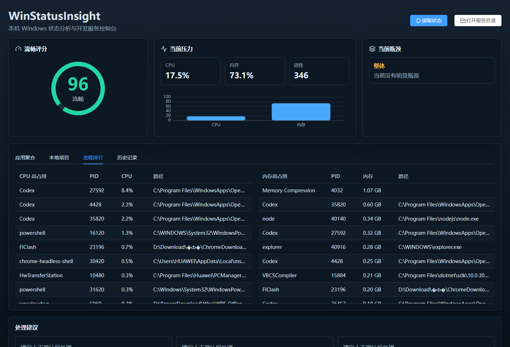
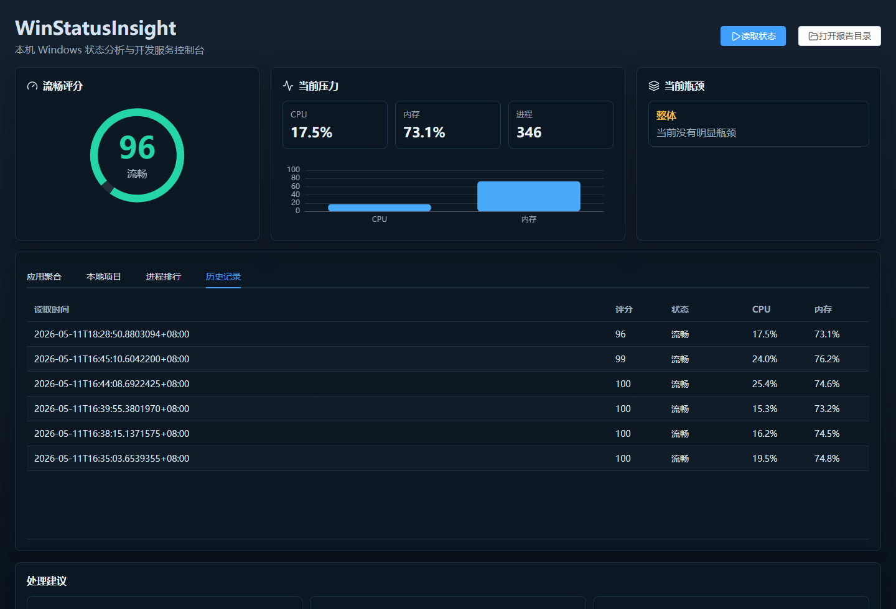

# WinStatusInsight

WinStatusInsight 是一个本地 Windows 状态分析桌面工具，用来快速判断电脑卡顿主要来自 CPU、内存、浏览器、资源管理器、本地开发服务，还是后台自启/服务进程。


## 下载

- [便携版 WinStatusInsight.exe](https://github.com/zgxhh/WinStatusInsight/releases/latest/download/WinStatusInsight.exe)
- [安装版 WinStatusInsight-Setup-1.0.0.exe](https://github.com/zgxhh/WinStatusInsight/releases/latest/download/WinStatusInsight-Setup-1.0.0.exe)

## 功能

- 读取 Windows 当前 CPU、内存和进程状态。
- 聚合多进程应用，例如 Chrome、Edge、Node/Vite、Codex、Windows 资源管理器。
- 给出流畅度评分、当前瓶颈和可处理建议。
- 识别正在运行的本地开发项目，支持 Vite、Next、Node、.NET Web API、.NET watch 等。
- 支持停止可确认的本地项目进程，并保护当前分析面板不被误停。
- 支持保存历史快照，并做两次读取结果的历史对比。
- 支持打包为 Windows 便携版和 NSIS 安装版。

## 产品截图

### 应用聚合


### 本地项目


### 进程排行



### 历史记录



## 技术栈

- Vue 3
- Vite
- Element Plus
- ECharts
- lucide-vue-next
- Node.js + Express
- PowerShell Windows 状态采集
- Electron + electron-builder

## 开发运行

```powershell
npm install
npm run dev
```

默认地址：

```text
前端：http://127.0.0.1:5273
后端：http://127.0.0.1:5274
```

## 桌面调试

```powershell
npm run electron:dev
```

## 打包

生成便携版：

```powershell
npm run package:win
```

生成安装版：

```powershell
npm run package:win:installer
```

产物默认位于：

```text
release/WinStatusInsight.exe
release/WinStatusInsight Setup 1.0.0.exe
```

## 数据位置

- 开发环境快照：`data/snapshots`
- 打包版快照：Electron 用户数据目录下的 `data/snapshots`
- PowerShell 采集脚本：`scripts/collect-status.ps1`

## 注意

Windows 首次运行未签名的本地打包程序时，可能会触发 SmartScreen 或安全软件提示。
